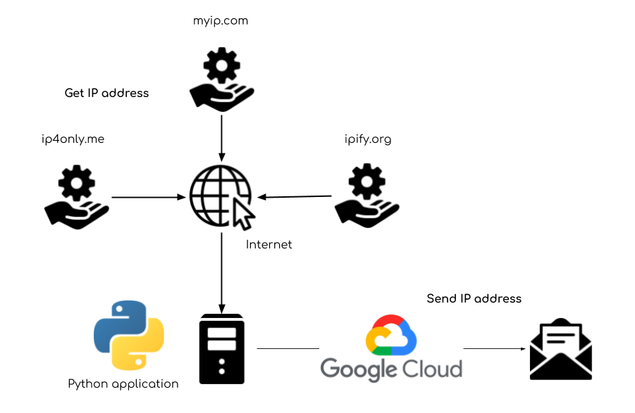
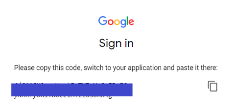
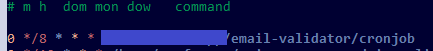

## My IP Address

This application will send your server's current external IP address to an email address using 3 services (for redundancy) `ip4only.me`, `myip.com`, `ipify.org`.

The purpose of this is to serve as an alternative to DDNS clients.

 |
------------ | 
_Concept_ | 

### Requirements

* A machine with a scheduler that can run Python and 24/7 availability
* Access to a Gmail account for sending emails
* Google Cloud credentials from [email-forwarding-validator](https://github.com/masonpimentel/email-forwarding-validator)

### Set up Python Application

This section describes how to set up your environment to run the Python application, including pulling the code, installing necessary tools and dependencies, getting your API token and configuring the app. 

#### Clone repository

Make sure you're in the directory where you want to run the Python application and Cronjob from. The rest of these steps will denote the current directory by `<path>`

```
$ git clone https://github.com/masonpimentel/my-ip.git
```

Alternatively, if you want to use SSH:

```
$ git clone git@github.com:masonpimentel/my-ip.git
```

#### Install relevant tools

To run the Python application you will need to install Python as well as some dependencies.

##### Python

The steps you take to install Python largely depends on the OS or distribution you're using. Chances are you already have Python installed or it was there by default. **The most important thing is that you have Python 3** (not Python 2). You will also need [pip](https://en.wikipedia.org/wiki/Pip_(package_manager)) for Python 3. Here are the steps for installing from the Python docs:

https://docs.python-guide.org/starting/install3/linux/

If you happen to be using Ubuntu 18.04 server, Python 3 is already installed but pip can be installed using the following:

```
$ sudo apt-get install python3-pip
``` 

Check your Python version using the `-V` argument:

```
$ python3 -V
Python 3.6.5
```

Note that for for Ubuntu 18.04 server, `python3` is used to invoke Python 3, `python` runs Python 2. Similarly for pip, `pip3` is used to invoke the package manager for Python 3.

Check that `pip3` is set up correctly:

```
$ pip3 -V
pip 9.0.1 from /usr/lib/python3/dist-packages (python 3.6)
```

##### Google API client dependencies

Run the following:

```
$ pip3 install --upgrade google-api-python-client oauth2client
```

#### Add credentials

Using the same credentials-send.json from [email-forwarding-validator](https://github.com/masonpimentel/email-forwarding-validator), copy and paste the contents into `<path>/my-ip/credentials.json` (replace the existing contents).

#### Configure token

We will now use our credentials to get our API token for sending requests to our projects.

Run `config.py`:

```
$ python3 config.py --noauth_local_webserver
```

Follow the link shown by entering it in any browser.

 |
------------ | 
_Authenticating the app in a browser_ |

Copy the code and enter it in your command line window. This will set up your API token.

##### Clear configuration

If for any reason you need to clear your configuration, just delete `token.json`.

### Using the App

This section describes how to manually execute the app (the last section explains how to set it up to run automatically).

### Complete configuration JSON

Open `config.json` and fill in the missing values in `from_email` and `target_email`. `target_email` is the email address that will receive the emails. 

#### Running for the First Time

You can make a manual run by running:

```
$ python3 send-ip.py
```

### Scheduling Runs Using Cron

First, find where your python executable is located:

```
which python3
/usr/bin/python3
```

To open the [crontab](http://man7.org/linux/man-pages/man5/crontab.5.html) run:

```
$ crontab -e
```

This should open the file in your preferred editor. Add the following line:

```
0 */1 * * * cd <path to my-ip> && <python path> send-ip.py
```

Ex: 

`0 */1 * * * cd /home/masonpimentel/my-ip && /usr/bin/python3 send-ip.py`

 |
------------ | 
_Editing the crontab_ |

This will run the script hourly, as denoted by the `0` in the minutes column, and the `*/1` in the hours column, and asterisks for the remaining columns. See [cronjob](cronjob).


#### Hint for development

To debug the output of the cronjob, you can use the following, which will pipe stdout and stderr to a text file:

```
<minute> <hour> * * * cd <path to my-ip> && <python path> send-ip.py >> <path>/log.txt 2>&1
```

Ex: 

`0 */1 * * * cd /home/masonpimentel/my-ip && /usr/bin/python3 send-ip.py >> /home/masonpimentel/log.txt 2>&1`

---

[Email Open icon](https://icons8.com/icons/set/email-open) icon by [Icons8](https://icons8.com) | [Internet icon](https://icons8.com/icons/set/internet) icon by [Icons8](https://icons8.com) | [Server icon](https://icons8.com/icons/set/server) icon by [Icons8](https://icons8.com) | [Service icon](https://icons8.com/icons/set/service) icon by [Icons8](https://icons8.com)