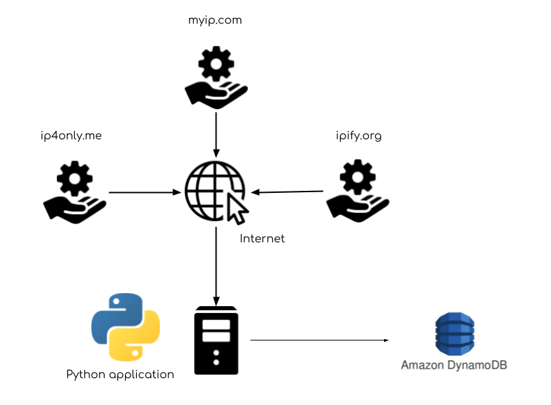
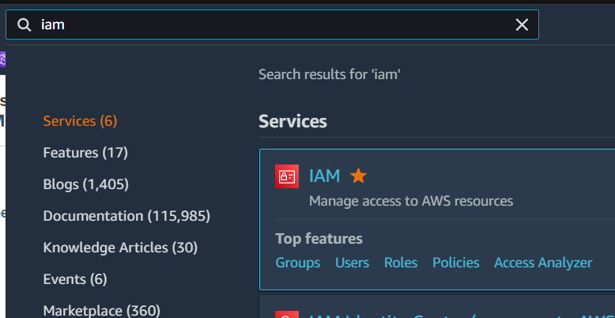
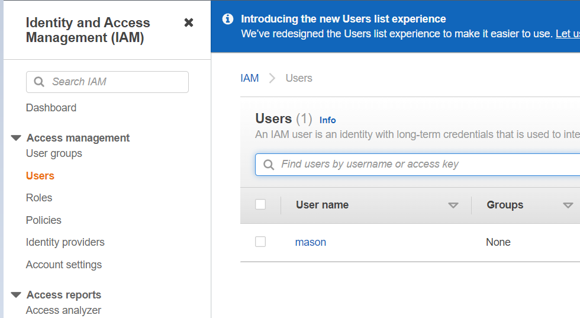
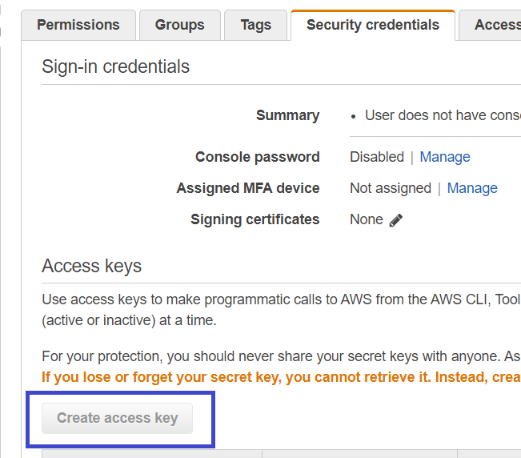
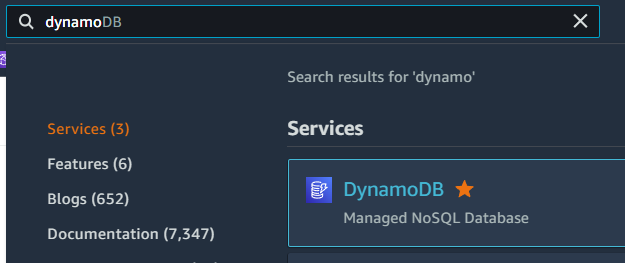
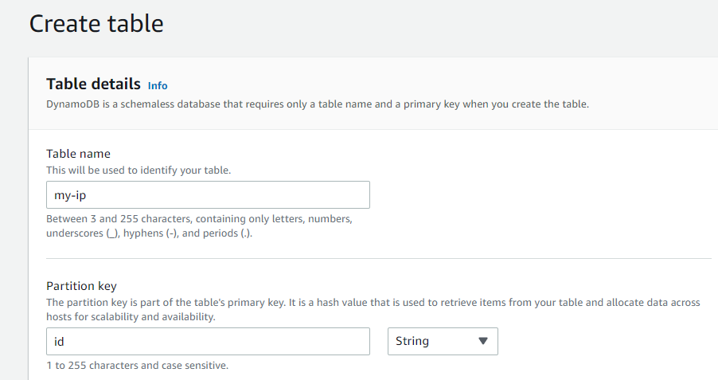
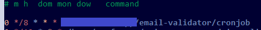

## My IP Address

This application will send your server's current external and internal (local) IP address to AWS DynamoDB using 3 services (for redundancy) `ip4only.me`, `myip.com`, `ipify.org`.

The purpose of this is to serve as an alternative to DDNS clients.

 |
------------ | 
_Concept_ | 

### Requirements

* A machine with a scheduler that can run Python and 24/7 availability
* An active AWS account

### Set up Python application

This section describes how to set up your environment to run the Python application, including pulling the code, installing necessary tools and dependencies and configuring the app. 

#### Clone repository

Make sure you're in the directory where you want to run the Python application and Cronjob from. The rest of these steps will denote the current directory by `<path>`

```
$ git clone https://github.com/masonpimentel/my-ip.git
```

Alternatively, if you want to use SSH:

```
$ git clone git@github.com:masonpimentel/my-ip.git
```

#### Install relevant tools

To run the Python application you will need to install Python as well as some dependencies.

##### Python

The steps you take to install Python largely depends on the OS or distribution you're using. Chances are you already have Python installed or it was there by default. **The most important thing is that you have Python 3** (not Python 2). You will also need [pip](https://en.wikipedia.org/wiki/Pip_(package_manager)) for Python 3. Here are the steps for installing from the Python docs:

https://docs.python-guide.org/starting/install3/linux/

If you happen to be using Ubuntu 18.04 server, Python 3 is already installed but pip can be installed using the following:

```
$ sudo apt-get install python3-pip
``` 

Check your Python version using the `-V` argument:

```
$ python3 -V
Python 3.6.5
```

Note that for for Ubuntu 18.04 server, `python3` is used to invoke Python 3, `python` runs Python 2. Similarly for pip, `pip3` is used to invoke the package manager for Python 3.

Check that `pip3` is set up correctly:

```
$ pip3 -V
pip 9.0.1 from /usr/lib/python3/dist-packages (python 3.6)
```

##### Boto

Run the following:

For more info on the Python AWS SDK: https://boto3.amazonaws.com/v1/documentation/api/latest/index.html

```
$ pip3 install boto3
```

#### Configure AWS

You'll need to get your AWS access key and edit configuration files so that the app will have access to your Dynamo DB table, also set up the Dynamo table you want to write to.

##### Get AWS credentials

See here for more detailed info: https://docs.aws.amazon.com/general/latest/gr/aws-sec-cred-types.html

These steps are based on AWS console's UI at this time of writing

After logging into AWS console: https://aws.amazon.com/console/, go to IAM:

 |
------------ | 
_IAM_ |

Go to `users`, then click on the `Security credentials` tab:

 |
------------ | 
_Security credentials_ |

Click on `Create access key` then go through the steps to retrieve your `aws_access_key_id` and `aws_secret_access_key`:

 |
------------ | 
_Create access key_ |

##### Edit/create config files

See here for more detailed info: https://docs.aws.amazon.com/cli/latest/userguide/cli-configure-files.html

Note that these steps assume the AWS profile `my-ip` is used. You can use a different profile name, just edit the `config.json` "profile_name"

Adjust this command as needed (remove parts if you already have them) and run:
```
$ mkdir ~/.aws && touch ~/.aws/credentials && touch ~/.aws/config
```

Using your preferred editor, edit the files as the following:

credentials
```
[my-ip]
aws_access_key_id=<put aws_access_key_id here>
aws_secret_access_key=<put aws_secret_access_key here>
```

Note: see here for other available AWS regions: https://aws.amazon.com/about-aws/global-infrastructure/regions_az/

config
```
[profile my-ip]
region=us-west-2
```

##### Create a DynamoDB table

You'll need to create a table in DynamoDB where the IP addresses will be written to. By default, the name `my-ip` is used, but like the AWS profile this can be changed and configured in `config.json` "table_name".

First open Dynamo in AWS:

 |
------------ | 
_DynamoDB_ |

Click on `Create table`. The most important fields are `Table name` and `Partition key`. For the default config, `Table name` should be `my-ip` (can be changed and configured in `config.json` "table_name"). `Partition key` should be `id` (this isn't configurable, but the code can be adjusted):

 |
------------ | 
_Create table_ |

All the other settings can be left as default, or customized to your liking. Click on `Create table`.

### Using the App

This section describes how to manually execute the app (the last section explains how to set it up to run automatically).

#### Running for the first time

You can make a manual run by running:

```
$ python3 send-ip.py
```

### Scheduling Runs Using Cron

First, find where your python executable is located:

```
which python3
/usr/bin/python3
```

To open the [crontab](http://man7.org/linux/man-pages/man5/crontab.5.html) run:

```
$ crontab -e
```

This should open the file in your preferred editor. Add the following line:

```
0 */1 * * * cd <path to my-ip> && <python path> send-ip.py
```

Ex: 

`0 */1 * * * cd /home/masonpimentel/my-ip && /usr/bin/python3 send-ip.py`

 |
------------ | 
_Editing the crontab_ |

This will run the script hourly, as denoted by the `0` in the minutes column, and the `*/1` in the hours column, and asterisks for the remaining columns. See [cronjob](cronjob).


#### Hint for development

To debug the output of the cronjob, you can use the following, which will pipe stdout and stderr to a text file:

```
<minute> <hour> * * * cd <path to my-ip> && <python path> send-ip.py >> <path>/log.txt 2>&1
```

Ex: 

`0 */1 * * * cd /home/masonpimentel/my-ip && /usr/bin/python3 send-ip.py >> /home/masonpimentel/log.txt 2>&1`

---

[Email Open icon](https://icons8.com/icons/set/email-open) icon by [Icons8](https://icons8.com) | [Internet icon](https://icons8.com/icons/set/internet) icon by [Icons8](https://icons8.com) | [Server icon](https://icons8.com/icons/set/server) icon by [Icons8](https://icons8.com) | [Service icon](https://icons8.com/icons/set/service) icon by [Icons8](https://icons8.com)